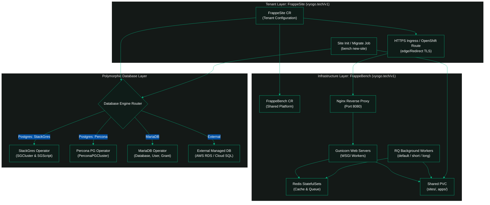

# Frappe Operator Architecture

This document describes the system architecture, reconciliation lifecycle, and component model of the **Frappe Operator** by **Vyogo Technologies**.

---

## <i data-lucide="network"></i> 1. Architectural Overview

The operator manages Frappe applications through a clear separation of concerns between shared infrastructure (**`FrappeBench`**) and isolated multi-tenant workloads (**`FrappeSite`**).



---

## <i data-lucide="layers"></i> 2. Core Resource Layers

### <i data-lucide="server"></i> 2.1 `FrappeBench` (Infrastructure Layer)
The `FrappeBench` represents shared, multi-tenant application infrastructure. It provisions:
- **Shared Storage**: A `PersistentVolumeClaim` (PVC) structured like a standard Frappe bench (`sites/`, `apps/`, `logs/`).
- **Bench Initialization**: Executes `<bench-name>-init` to sync pre-compiled assets from container images and build `apps.txt`.
- **Runtime Pods**: Deploys `Nginx`, `Gunicorn`, `SocketIO`, `Scheduler`, and background `Worker` tiers.
- **Cache & Queue**: Dedicated `Redis` statefulsets for cache and RQ queues.
- **Autoscaling**: Configured via `componentAutoscaling` using standard Kubernetes HPA or KEDA.

### <i data-lucide="globe"></i> 2.2 `FrappeSite` (Tenant Layer)
The `FrappeSite` represents an individual tenant site within a `FrappeBench`:
- **Database Provisioning**: Dispatches to the resolved `DatabaseProvider` to provision an isolated database, role, and credentials.
- **Site Initialization**: Spawns a batch Job (`<site-name>-init`) executing `bench new-site` inside the bench storage context.
- **Network Routing & TLS**: Reconciles a Kubernetes Ingress or OpenShift Route pointing to the bench's Nginx service with enforced HTTPS edge redirection.

---

## <i data-lucide="database"></i> 3. Polymorphic Database Architecture

The operator implements a SOLID-compliant provider design pattern defined in `controllers/database/provider.go`:

```go
type DatabaseProvider interface {
    EnsureDatabase(ctx context.Context, site *frappev1.FrappeSite) (*DatabaseConnection, error)
    Cleanup(ctx context.Context, site *frappev1.FrappeSite) error
    ResolveHostPort(ctx context.Context, site *frappev1.FrappeSite) (string, int32, error)
    GetCredentials(ctx context.Context, site *frappev1.FrappeSite) (string, string, error)
}
```

### Supported Providers:
1. **`PostgresProvider`** (`controllers/database/postgres_provider.go`):
   - **StackGres (`stackgres`)**: Emits declarative `SGCluster` and `SGScript` templates. Schema creation runs over JDBC without CLI meta-command dependencies.
   - **Percona (`percona`)**: Manages dedicated `PerconaPGCluster` resources.
   - **Shared PostgreSQL**: Connects to an existing PostgreSQL cluster and executes tenant role and database creation jobs.
2. **`MariaDBProvider`** (`controllers/database/mariadb_provider.go`):
   - Delegates database, user, and permission grants to the MariaDB Operator.
3. **`ExternalProvider`** (`controllers/database/external_provider.go`):
   - Reads credentials from external secrets for managed services like AWS RDS or Google Cloud SQL.

---

## <i data-lucide="shield-check"></i> 4. Security & Compliance (`restricted-v2`)

The operator is engineered for strict enterprise compliance on OpenShift and hardened Kubernetes clusters:
- **Dynamic UID Allocation**: `runAsUser` defaults to `nil`, allowing OpenShift to dynamically allocate non-root UIDs per namespace.
- **Prohibition of `fsGroup: 0`**: Storage permissions rely on platform-managed GIDs rather than root group escalation.
- **Linux Capabilities**: All runtime containers drop all Linux capabilities (`drop: ["ALL"]`) and disallow privilege escalation.

---

## <i data-lucide="folder-git-2"></i> 5. Repository Directory Layout

- `api/v1/`: Go struct definitions and Kubebuilder CRD schemas (Source of truth).
- `controllers/`: Operator reconciliation loops (`FrappeBench`, `FrappeSite`, `SiteApp`, `SiteDomain`).
- `controllers/database/`: Polymorphic database providers (`postgres_stackgres.go`, `postgres_percona.go`, `mariadb_provider.go`).
- `pkg/scripts/templates/`: Shell execution templates for site initialization and migrations.
- `helm/frappe-operator/`: Production Helm chart with embedded CRD manifests.
