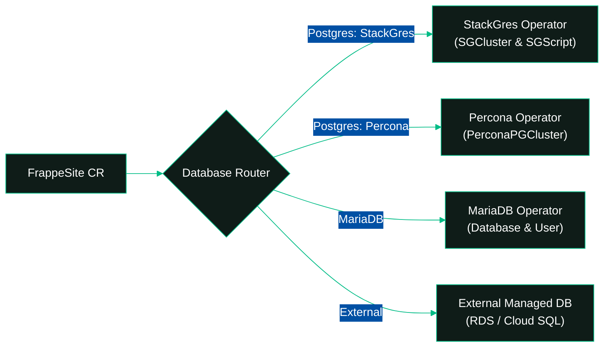

# <i data-lucide="book-open"></i> Concepts

Understanding the core concepts, multi-tenancy model, and architecture of **Frappe Operator** by **Vyogo Technologies**.

---

## <i data-lucide="network"></i> Overview

Frappe Operator orchestrates Frappe and ERPNext deployments using a clean separation of concerns between shared infrastructure and isolated tenant workloads:

- **`FrappeBench`**: Shared platform infrastructure hosting web proxies, message brokers, shared storage, and worker pools.
- **`FrappeSite`**: Individual tenant sites encapsulating isolated databases, site configurations, file storage, and TLS-terminated routing.

This decoupled architecture enables high tenant density, rapid provisioning, and strict resource isolation.

---

## <i data-lucide="layers"></i> Core Resource Architecture

### <i data-lucide="server"></i> FrappeBench (Shared Platform)

A **`FrappeBench`** represents the underlying application platform shared across multiple sites:

```yaml
apiVersion: vyogo.tech/v1
kind: FrappeBench
metadata:
  name: production-bench
  namespace: frappe-system
spec:
  frappeVersion: "version-15"
  apps:
    - "erpnext"
    - "hrms"
  storage:
    size: 50Gi
    storageClassName: "standard-rwx"
```

**Components Managed by FrappeBench:**
- **NGINX Reverse Proxy**: In-cluster reverse proxy routing requests by HTTP `Host` header to WSGI processes on port 8080.
- **Redis StatefulSets**: Dedicated in-memory caching and Redis Queue (RQ) brokers.
- **Shared Persistent Volume (RWX)**: Shared bench volume hosting `apps/`, assets, and common configurations.
- **Bench Init Job**: Syncs container assets and verifies app compatibility prior to runtime startup.
- **Background Workers & Web Servers**: Scalable Gunicorn WSGI servers and RQ workers (`default`, `short`, `long`).

---

### <i data-lucide="globe"></i> FrappeSite (Tenant Isolation)

A **`FrappeSite`** represents an individual tenant site provisioned inside a parent `FrappeBench`:

```yaml
apiVersion: vyogo.tech/v1
kind: FrappeSite
metadata:
  name: customer1-site
  namespace: frappe-system
spec:
  benchRef:
    name: production-bench
  siteName: "customer1.example.com"
  dbConfig:
    provider: postgres
    postgresEngine: stackgres
    mode: dedicated
    storageSize: 20Gi
```

**Components Managed by FrappeSite:**
- **Polymorphic Database**: Automated provisioning of isolated databases and user credentials via StackGres, Percona, MariaDB, or external providers.
- **Site Lifecycle Job**: Batch Job (`<site-name>-init` or `<site-name>-migrate`) executing `bench new-site` or `bench --site <name> migrate`.
- **Tenant Storage**: Site-specific subdirectories on the shared PVC (`sites/<site-name>/public` and `sites/<site-name>/private`).
- **HTTPS Routing**: Kubernetes Ingress or OpenShift Route configured with enforced HTTPS edge TLS termination.

---

## <i data-lucide="database"></i> Polymorphic Database Architecture

Frappe Operator v5.2.0 features a polymorphic database routing layer, allowing you to run PostgreSQL or MariaDB across shared, dedicated, or external topologies.



### 1. PostgreSQL with StackGres (`stackgres`)

Deploys enterprise PostgreSQL clusters using StackGres with automated schema initialization over JDBC:

```yaml
dbConfig:
  provider: postgres
  postgresEngine: stackgres
  mode: dedicated
  storageSize: 30Gi
  resources:
    requests:
      cpu: 500m
      memory: 1Gi
    limits:
      cpu: "2"
      memory: 4Gi
```

### 2. PostgreSQL with Percona (`percona`)

Provisions cloud-native PostgreSQL clusters via the Percona Operator for PostgreSQL:

```yaml
dbConfig:
  provider: postgres
  postgresEngine: percona
  mode: dedicated
  storageSize: 50Gi
```

### 3. Shared MariaDB Mode

Multiple sites share a centrally managed MariaDB instance with isolated database names and separate user credentials:

```yaml
dbConfig:
  provider: mariadb
  mode: shared
  mariadbRef:
    name: shared-mariadb
    namespace: databases
```

### 4. External Database Mode

Connects to pre-existing managed database services (e.g., AWS Aurora, Google Cloud SQL, Crunchy Data) using Kubernetes Secrets:

```yaml
dbConfig:
  provider: external
  mode: external
  connectionSecretRef:
    name: customer1-external-db
```

The Secret must contain:
```yaml
apiVersion: v1
kind: Secret
metadata:
  name: customer1-external-db
stringData:
  host: "db.production.example.com"
  port: "5432"
  database: "customer1_db"
  username: "customer1_user"
  password: "supersecretpassword"
```

---

## <i data-lucide="shield-check"></i> Enterprise Security & Compliance

Frappe Operator is certified for hardened OpenShift clusters and strictly adheres to `restricted-v2` Security Context Constraints (SCC):

- **Dynamic Non-Root UIDs**: No hardcoded UIDs (`runAsUser: nil`). Containers run with the UID dynamically assigned by the platform namespace.
- **Root Group Escalation Prohibited**: `fsGroup: 0` is strictly avoided; storage group IDs are assigned by the cluster.
- **Complete Capability Drop**: Pods explicitly drop all Linux capabilities (`drop: ["ALL"]`) with `allowPrivilegeEscalation: false`.
- **Enforced HTTPS Ingress**: HTTP traffic is automatically redirected to HTTPS at the ingress/route layer.

---

## <i data-lucide="cpu"></i> Resource Management & QoS

### Long-Running Pod Resources (`componentResources`)

Long-running bench components (Nginx, Gunicorn, Workers) are sized via `componentResources`:

```yaml
componentResources:
  gunicorn:
    requests:
      cpu: 500m
      memory: 1Gi
    limits:
      cpu: "2"
      memory: 2Gi
  workerDefault:
    requests:
      cpu: 250m
      memory: 512Mi
    limits:
      cpu: "1"
      memory: 1Gi
```

### Batch Job Resources (`jobResources`)

Transient operational batch Jobs (site init, migrations, app installations, backups) are sized via `jobResources` to guarantee **Burstable QoS** and prevent eviction under node pressure:

```yaml
jobResources:
  default:
    requests:
      cpu: 100m
      memory: 256Mi
    limits:
      cpu: "1"
      memory: 1Gi
  siteInit:
    requests:
      cpu: 500m
      memory: 1Gi
    limits:
      cpu: "2"
      memory: 3Gi
  appInstall:
    requests:
      cpu: 500m
      memory: 1Gi
    limits:
      cpu: "2"
      memory: 4Gi
```

---

## <i data-lucide="arrow-right-circle"></i> Next Steps

- **[Architecture Guide](ARCHITECTURE.md)**: Technical breakdown of operator reconciliation loops and design patterns.
- **[API Reference](api-reference.md)**: Full schema specifications for `FrappeBench`, `FrappeSite`, and CRDs.
- **[PostgreSQL Integration Guide](POSTGRESQL_INTEGRATION.md)**: Setup and tuning guide for StackGres and Percona engines.
- **[OpenShift Enterprise Guide](INSTALL_OPENSHIFT.md)**: Deploying on Red Hat OpenShift under `restricted-v2` SCC.
