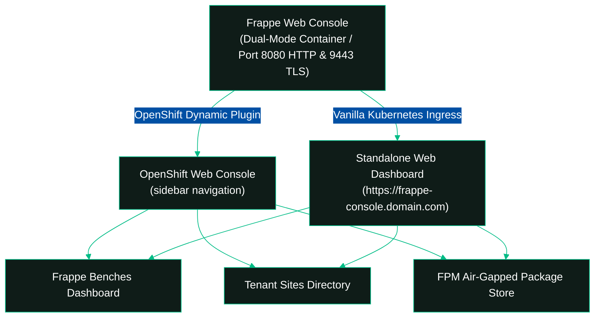

# <i data-lucide="layout"></i> Frappe Web Console: OpenShift Plugin & Standalone Kubernetes Dashboard

This document guides cluster administrators on deploying, enabling, and using the **Frappe Web Console** by **Vyogo Technologies**, supporting both **Red Hat OpenShift 4.12+ (Dynamic Console Plugin)** and **Standard Kubernetes (AWS EKS, GCP GKE, AKS, Kind)**.

---

## <i data-lucide="sparkles"></i> Overview

The **Frappe Web Console** is a dual-mode enterprise web application designed to run seamlessly in two environments:
1. **Red Hat OpenShift**: As an official **Dynamic Console Plugin** integrating into the OpenShift Web Console navigation menu.
2. **Vanilla Kubernetes**: As a **Standalone Web Dashboard & Portal** exposed via Kubernetes Ingress or port-forwarding.

### Core Capabilities:
- **Frappe Benches Dashboard**: Interactive overview of shared platform infrastructure, worker autoscaling, storage PVCs, and connected tenant counts.
- **Tenant Sites Directory**: Real-time directory of `FrappeSite` custom resources, displaying phase status pills, polymorphic database engines (StackGres, Percona, MariaDB, External), and direct links to HTTPS Routes/Ingresses.
- **FPM Air-Gapped Package Store**: Sovereign package browser listing registered FPM repositories, published applications, pre-compiled assets, and a 1-click "Install to Bench" modal that requires zero public internet (PyPI/NPM) access.



---

## <i data-lucide="server"></i> Option A: Deploying on Standard Kubernetes (EKS / GKE / AKS / Kind)

On vanilla Kubernetes clusters, the console runs as a standalone web portal.

### Quick Start (Local / Port-Forward)

```bash
# 1. Deploy the console workload and service
kubectl apply -f console-plugin/deploy/deployment.yaml
kubectl apply -f console-plugin/deploy/service.yaml

# 2. Port-forward the HTTP service to your local machine
kubectl port-forward -n frappe-operator-system svc/frappe-console-plugin 8080:8080

# 3. Open in your browser
open http://localhost:8080
```

### Production Deployment via Ingress

Expose the dashboard on your cluster's domain using standard Kubernetes Ingress:

```bash
# Apply production ingress with automatic cert-manager TLS
kubectl apply -f console-plugin/deploy/ingress.yaml
```

The manifest configures:
- Service routing on port `8080` (HTTP).
- Automatic TLS termination via `cert-manager.io/cluster-issuer`.
- URL accessible at `https://frappe-console.example.com`.

---

## <i data-lucide="layers"></i> Option B: Deploying on Red Hat OpenShift (Console Plugin)

On OpenShift 4.12+, the console automatically detects OpenShift serving certificates and operates as an in-console dynamic plugin.

### Step 1: Deploy Console Plugin Workloads

The deployment manifests are located in [`console-plugin/deploy/`](../console-plugin/deploy/):

```bash
# 1. Deploy the non-root Nginx web bundle
oc apply -f console-plugin/deploy/deployment.yaml

# 2. Deploy the Service with OpenShift automatic TLS cert injection
oc apply -f console-plugin/deploy/service.yaml

# 3. Register the ConsolePlugin resource with OpenShift
oc apply -f console-plugin/deploy/consoleplugin.yaml
```

### Step 2: Enable Plugin in OpenShift Console Operator

Enable the plugin dynamically in your OpenShift cluster console configuration:

```bash
oc patch console.operator.openshift.io cluster --type=json -p '[
  {
    "op": "add",
    "path": "/spec/plugins/-",
    "value": "frappe-console-plugin"
  }
]'
```

*Within 30 seconds, a banner will prompt in the OpenShift Web Console: **"Web console update is available. Refresh web console"**.*

---

## <i data-lucide="eye"></i> Console Views & Features

### 1. Frappe Benches
- **OpenShift**: Left Navigation &rarr; **Frappe Platform** &rarr; **Frappe Benches**
- **Kubernetes Standalone**: Top Header &rarr; **Frappe Benches**
- **Capabilities**:
  - Live table of all `FrappeBench` instances across namespaces.
  - Sizing indicators (WSGI replicas, RQ queue length, Redis cache status).
  - Storage allocation and PVC health.
  - Count of attached tenant sites and registered FPM repositories.

### 2. Tenant Sites Directory
- **OpenShift**: Left Navigation &rarr; **Frappe Platform** &rarr; **Tenant Sites**
- **Kubernetes Standalone**: Top Header &rarr; **Tenant Sites**
- **Capabilities**:
  - Global tenant search by domain, name, or namespace.
  - Status Pills: `Ready` (Green), `Provisioning` (Blue), `Failed` (Red).
  - Database Engine Badges:
    - `PG (StackGres) - Dedicated`
    - `PG (Percona) - Dedicated`
    - `MariaDB - Shared`
  - **Launch Desk**: 1-click button opening the tenant's secure HTTPS Route or Ingress.

### 3. FPM Package Store
- **OpenShift**: Left Navigation &rarr; **Frappe Platform** &rarr; **FPM Package Store**
- **Kubernetes Standalone**: Top Header &rarr; **FPM Air-Gapped Store**
- **Capabilities**:
  - **Repository Management**: Monitor internal sovereign Nexus, Artifactory, or private FPM servers.
  - **Package Catalog**: Cards for verified, air-gapped applications (`frappe`, `erpnext`, `hrms`, `payments`, and custom enterprise apps).
  - **Install to Bench Wizard**: 1-click modal selecting target `FrappeBench` to declaratively install the app without runtime compilation or public egress.

---

## <i data-lucide="file-code-2"></i> OLM OperatorHub Form Descriptors

For teams creating resources via OpenShift **OperatorHub**, the operator's `ClusterServiceVersion` (CSV) defines rich `specDescriptors` and `statusDescriptors`:

- **Interactive Dropdowns**: Select database provider (`postgres`, `mariadb`, `external`) and engine (`stackgres`, `percona`).
- **Boolean Toggles**: Toggle OpenShift Route creation, skip initialization, or force HTTPS edge termination.
- **Resource Sizing Widgets**: Visual selectors for memory, CPU requests/limits, and persistent volume sizes.
- **Status Cards**: Visual representation of site phase, database provisioning readiness, and clickable HTTPS URLs.

---

## <i data-lucide="shield-check"></i> Security & Compliance

- **`restricted-v2` Compliant**: The web container runs as non-root UID 1001, drops all Linux capabilities (`ALL`), and requires zero host privileges.
- **Dual-Mode Network Architecture**:
  - On OpenShift: Port `9443` HTTPS using OpenShift internal CA certificates (`service.beta.openshift.io/serving-cert-secret-name`).
  - On Kubernetes: Port `8080` HTTP for clean Ingress proxying or port-forwarding without SSL configuration hurdles.
